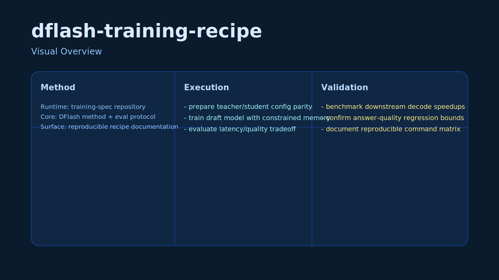

# DFlash Training Recipe

Training and evaluation recipe for DFlash draft models used in speculative decoding pipelines.

## Problem
Serving costs and latency can dominate LLM production workloads.

## Method
- Document training assumptions for draft models
- Track acceptance rate, throughput, latency, and quality deltas
- Provide reproducible evaluation guidance

## Reproducibility
```bash
# Read DFLASH_ANALYSIS.md
# Run evals on your hardware and compare acceptance rate / tok-s / latency
```

## Limitations
Results vary by model family, hardware, and decoding parameters.

## Visual Overview



